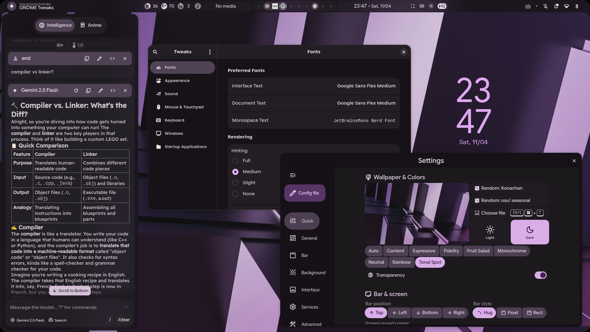

<div align="center">


# Illogical Impulse ISO

**[end-4's Illogical Impulse](https://github.com/end-4/dots-hyprland) Hyprland rice — as an installable, batteries-included distro.**

Boot it from a USB stick, fall in love, click *Install*, reboot into a finished system.<br/>
No Arch bootstrap, no setup script, no dotfile surgery. It's just... done.

[](https://github.com/El3ssar/illogical-impulse-iso/actions/workflows/validate.yml)
[](LICENSE)
[](https://archlinux.org)
[](https://github.com/end-4/dots-hyprland)
[](https://sourceforge.net/projects/illogical-impulse-iso/files/)



</div>

---

> [!NOTE]
> This is a community project building an ISO **around** end-4's
> [dots-hyprland](https://github.com/end-4/dots-hyprland) — all credit for the
> rice itself goes to [end-4](https://github.com/end-4) and contributors.
> The dots are consumed read-only as a pinned submodule; nothing is forked or
> patched. Docs for the rice live at [ii.clsty.link](https://ii.clsty.link).

## What you get

- **Live session first** — boot straight into the full rice (greetd → Hyprland →
  Quickshell) and try everything before touching your disk
- **Branded Calamares installer** — btrfs + systemd-boot, LUKS encryption,
  hibernation-capable swap, snapshot-ready subvolume layout
- **Batteries included** — browser, office, multimedia, dev
  tools, a second LTS kernel… every default baked in.
- **NVIDIA handled automatically** — hardware detected at install time; the
  open driver (Turing+) or the 580xx legacy branch installs **offline** from an
  on-ISO stash, and nothing touches AMD/Intel machines
- **Fully offline install** — dependencies resolved from upstream's own
  PKGBUILDs at build time, AUR packages pre-built, the Python venv built from
  an offline wheelhouse
- **`iictl`** on every install — `update --system` (repos + AUR + dots in one
  command), `doctor` health checks, the welcome card
- **Tracks upstream automatically** — the dots are a pinned submodule with a
  one-command, policy-gated bump

## Download

Grab the latest ISO from the [**Releases page**](https://github.com/El3ssar/illogical-impulse-iso/releases)
— each release links the download (served by SourceForge's mirror network)
and ships `SHA256SUMS` for verification. All builds are also browsable
[directly on SourceForge](https://sourceforge.net/projects/illogical-impulse-iso/files/).

```sh
sha256sum -c SHA256SUMS   # with the ISO in the same directory
```

## Build your own

Requirements: an Arch host with `archiso just rsync python base-devel git`.

```sh
git clone --recurse-submodules https://github.com/El3ssar/illogical-impulse-iso
cd illogical-impulse-iso
just build        # → out/illogical-impulse-YYYY.MM.DD-x86_64.iso
just vm           # boot it in QEMU  (--disk to test a full install, needs quemu installed)
```

| Recipe | What it does |
|---|---|
| `just build [profile]` | full pipeline → `out/*.iso` |
| `just prepare` / `just prebuild` | assemble profile / build AUR packages |
| `just validate` | ~150-check static audit, no root needed |
| `just update` | bump the dots pin (`--check` = policy dry-run) |
| `just vm [--disk\|--installed]` | QEMU: live ISO / install test / installed system |
| `just preview [app]` | live-preview a standalone Quickshell app (no build); no arg lists them |
| `just nspawn ['<cmd>']` | throwaway container to test CLI/`iictl` behaviour (no ISO); `--clean` drops the cache |
| `just assets` | regenerate branding from the SVG sources |
| `just docked [profile]` | the same full pipeline, inside the pinned builder container |

**Make it yours:** package manifests in [`packages/`](packages), distro-wide
dotfile overrides in [`overlay/skel-distro/`](overlay), your personal layer in
[`profiles/`](profiles) (git-ignored, with pinned-repo fetching). The full
tweaking handbook is [docs/GUIDE.md](docs/GUIDE.md); build-machine internals
are in [docs/BLUEPRINT.md](docs/BLUEPRINT.md).

## Status

Working: ISO build (native or `just docked` for a reproducible containerized
build on any docker host), live session, full install, NVIDIA auto-detect,
`iictl`, welcome card, validate CI, automated releases (daily upstream
check → build → QEMU smoke test → [SourceForge downloads](https://sourceforge.net/projects/illogical-impulse-iso/files/)
+ GitHub release notes). See the [blueprint](docs/BLUEPRINT.md) for details.

## License & credit

The build tooling in this repo is [MIT](LICENSE). The Illogical Impulse
dotfiles are the work of [end-4](https://github.com/end-4) and contributors
(GPL-3.0, consumed as a submodule). Not affiliated with Arch Linux.
